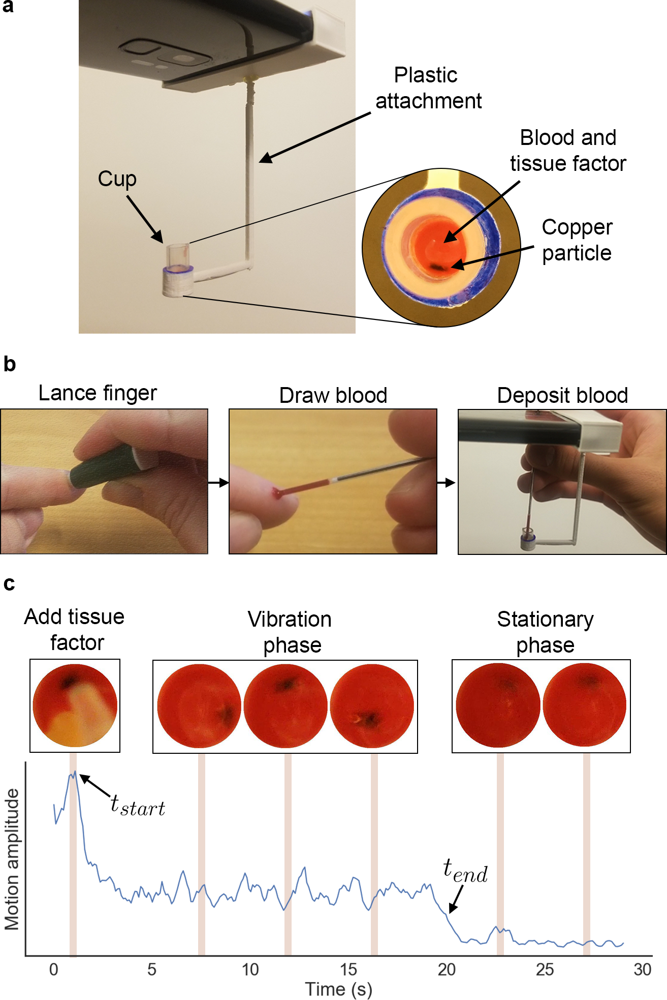

## Overview

This archive contains a video of a PT and INR measurement of a sample of whole blood measured on our system, as well as the code used to compute PT and INR from the video.

We provide python and MATLAB code for ease of reproducibility.

There are several dependencies required to run the code in this archive namely:
MATLAB
python
opencv-python (python package)

These scripts were originally run on:
Ubuntu 18.04.5
MATLAB R2021a
python v2.7.17
opencv-python v3.4.3

The programs should be able to run even if the versions do not exactly match.

The opencv-python package can be installed using the pip package manager like so:
pip install opencv-python==3.4.3.18

No non-standard hardware is required to run these programs.

--------------------------------------

Programs:
Running these four programs in the following order will calculate PT and INR values for the sample video.

* extract.py: This file extracts the individual video frames and outputs the frames to a directory.

* start_time.m: This file generates the motion curve for the pipette and is used to find the start time of the measurement.

* stop_time.m: This file generates the motion curve for the particle and is used to find the end time of the measurement.

* compute_pt.m: This file processes the pipette and particle motion curves to compute PT and INR values.

Helper files:
These helper files are called by the above programs.

* circlecropbw.m and circlecrop.m: These files are used to create a circular crop of video frames in order to isolate the particle from the background.

* knee_pt.m: This file is used to calculate the knee point of the curve.

Data:
* video.mp4: Video of a our system measuring PT and INR for a sample of whole blood.

--------------------------------------

Instructions to run programs:

(1) Extract frames from video.
Command: python3 extract.py
Runtime: 22 seconds

Expected output files: 
video/
This is a directory containing the video frames from video.mp4

(2) Generate pipette motion curve.

Run 'start_time.m' in MATLAB
Runtime: 25 seconds

Expected output files:
start_time_video.txt

This file contains the generated motion curve for the pipette.

(3) Generate particle motion curve.

Run 'stop_time.m' in MATLAB
Runtime: 28 seconds

Expected output files:
stop_time_video.txt

This file contains the generated motion curve for the particle.

(4) Compute PT and INR for pipette and particle motion curve.
Run 'compute_pt.m' in MATLAB.
Runtime: 7 ms

Expected printed output:
'PT: 12.1
 INR: 1.0'

--------------------------------------

